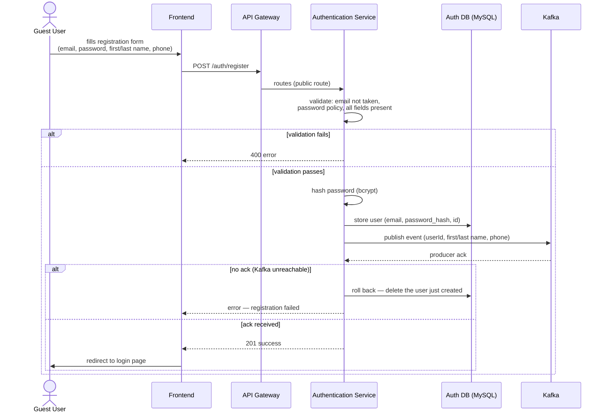
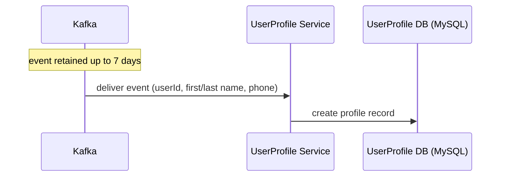
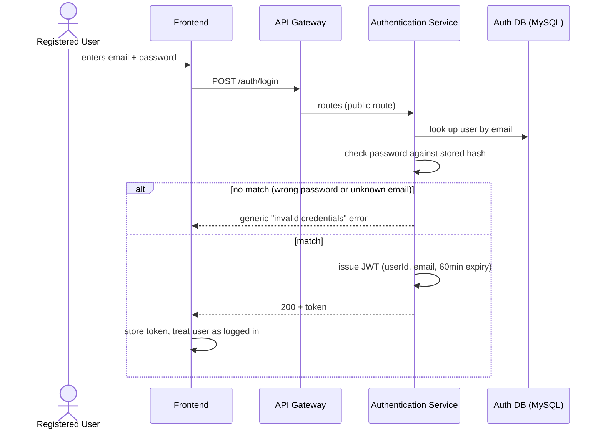
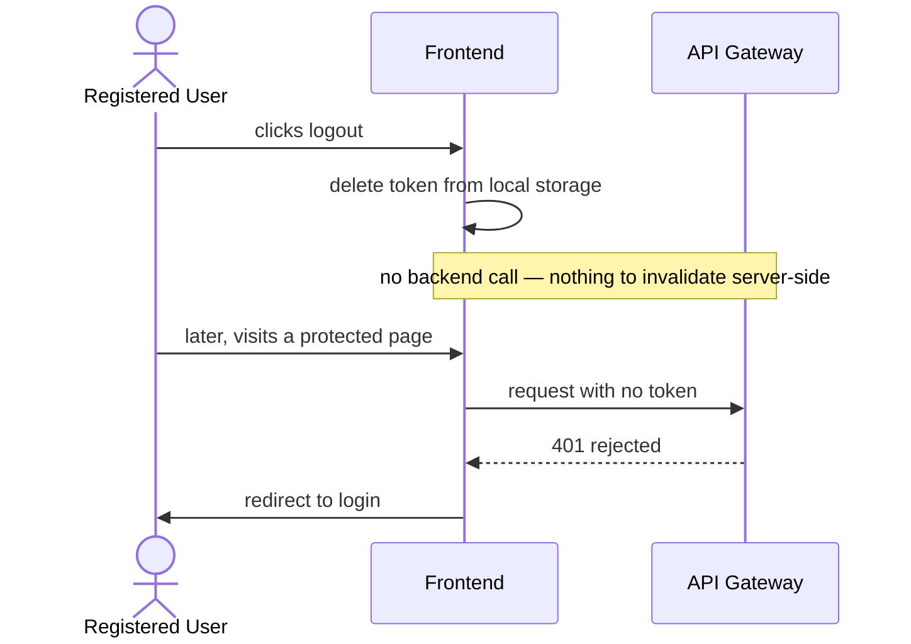

# Key Flows

## Registration

1. Guest User submits the registration form — email, password, first name, last name, phone
   number, all required — from the frontend.
2. Request reaches Authentication Service via the Gateway (public route, no token needed).
3. Authentication validates the request: email not already taken, password meets the policy, and
   every field is present (no field-specific format checks like phone shape — not built yet, see
   [`api-contract.md`](./api-contract.md)).
   - If any check fails, it returns an error immediately — nothing is stored, nothing is
     published.
4. Authentication hashes the password (bcrypt) and stores the new user record (email,
   password_hash, generated user ID).
5. Authentication publishes the registration event to Kafka (user ID, first name, last
   name, phone) and **waits for the broker's acknowledgment** that it was received — see
   [`messaging.md`](./messaging.md) and
   [ADR-0011](../../00-infrastructure/adr/0011-registration-waits-for-kafka-producer-ack.md).
   - If the broker doesn't acknowledge (Kafka unreachable), Authentication **deletes the
     credential it just created** in step 4, then returns an error. Without this rollback, the
     email would be stuck as "already registered" with no way to retry and no profile ever
     created — a dead-end account. Rolling back means a failed registration leaves no trace, and
     the user can simply try again.
6. Once acknowledged, Authentication returns success to the client.
7. The frontend sends the user to the login page (they are **not** automatically logged in).

### After registration: UserProfile picks up the event

This happens asynchronously and independently of the registration flow above — Authentication
has already responded to the client by this point and doesn't wait for it. See
[`messaging.md`](./messaging.md).

## Login

1. Registered User submits email + password from the frontend.
2. Request reaches Authentication Service via the Gateway (public route).
3. Authentication looks up the user by email and checks the password against the stored hash.
   - No match (wrong password, or no such email) → generic "invalid credentials" error, same
     message either way.
4. Match → Authentication issues a JWT (`userId`, `email`, 60-minute expiry) and returns it.
5. The frontend stores the token (used on every subsequent request until it expires or the user
   logs out) and treats the user as logged in.

## Logout

1. User clicks logout.
2. Frontend deletes the token from local storage.
3. Nothing is sent to the backend — there's no `/auth/logout` call to make. The user is
   effectively logged out because the frontend no longer has a token to send.
4. Next request to a protected route has no token → Gateway rejects it → frontend redirects to
   login.
