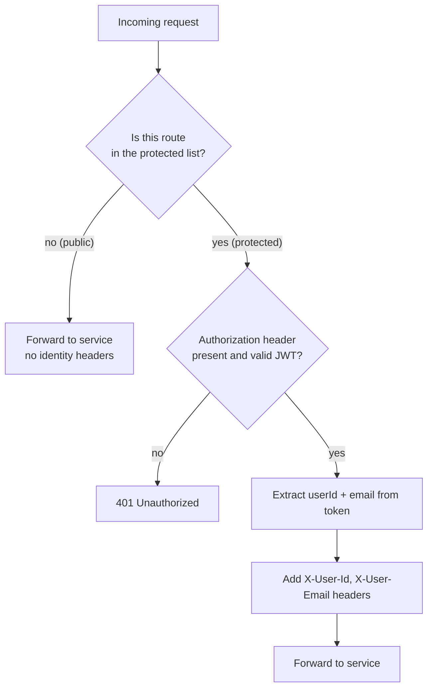

# API Gateway

A **standalone Spring Boot application** (Spring Cloud Gateway, per
[ADR-0007](../adr/0007-backend-build-and-gateway-tooling.md)) — the single entry point for every
request the frontend makes. No service is reachable directly; everything goes through here.

## What it does

1. **Routes** each request to the right service, by asking Eureka where that service currently
   lives (see [`../eureka-discovery/`](../eureka-discovery/) once written).
2. **Validates JWTs itself**, statelessly, with no call back to Authentication — see
   [ADR-0005](../adr/0005-stateless-jwt-validation-at-gateway.md).
3. **Decides which routes need a token at all** — not every route is protected — see
   [ADR-0009](../adr/0009-route-level-authorization-at-gateway.md).
4. **Forwards identity downstream** as trusted headers once a token is validated, so services
   don't parse JWTs themselves — see
   [ADR-0012](../adr/0012-gateway-forwards-identity-via-headers.md).
5. Applies CORS rules for the frontend's origin.

## The filter chain (per request)

"Valid" means: signature checks out against the shared key, and it hasn't expired. Nothing more
— the Gateway doesn't call Authentication to check anything (ADR-0005).

## Route protection map

Reflects the routes actually built in each service today — see each service's own
`api-contract.md` for the full contract (request/response shapes, error codes).

| Route | Service | Protection |
|---|---|---|
| `POST /api/auth/register` | Authentication | Public |
| `POST /api/auth/login` | Authentication | Public |
| `POST /api/auth/refresh` | Authentication | Public |
| `POST /api/auth/logout` | Authentication | Public |
| `POST /api/auth/change-password` | Authentication | **Protected** |
| `GET /profile` | UserProfile | **Protected** |
| `PUT /profile` | UserProfile | **Protected** |
| `GET /diagnosis` | Diagnosis | Public |
| `GET /diagnosis/{id}` | Diagnosis | Optional — shows less detail if no identity present |
| `GET /diagnosis/search` | Diagnosis | **Protected** |
| `GET /diagnosis/analysis` | Diagnosis | **Protected** |
| `POST /diagnosis/{id}/bookmark` | Diagnosis | **Protected** — bookmark *creation* lives here, not on Bookmark Service; it publishes to Kafka for Bookmark Service to consume, see [ADR-0015 and Diagnosis Service's `messaging.md`](../../01-services/diagnosis-service/messaging.md) |
| `GET /bookmarks` | Bookmark | **Protected** |
| `DELETE /bookmarks/{id}` | Bookmark | **Protected** |

Until this Gateway is actually built, every route above is called directly on its owning
service's own port, and "protected" today just means the service reads (and trusts, unvalidated)
an `X-User-Id` header sent by the caller — see the trust-model note in each service's README.

## What downstream services receive

For a protected route, the service behind the Gateway sees:
- `X-User-Id` — the caller's user ID, straight from the validated token's `userId` claim.
- `X-User-Email` — the caller's email, from the token's `email` claim.

The service trusts these outright — it has no way to reach the internet except through the
Gateway, so nothing but the Gateway could have set them. It does **not** re-validate the JWT or
re-check the headers against anything.

For a public route, no identity headers are added — there may not even be a token.

## Config & Environment

| Variable | Purpose |
|---|---|
| `SERVER_PORT` | Port this service listens on. |
| `JWT_SECRET` | Same signing key Authentication uses — needed to verify tokens locally. |
| `EUREKA_URL` | Where to look up service addresses. |
| `CORS_ALLOWED_ORIGIN` | The frontend's origin. |
