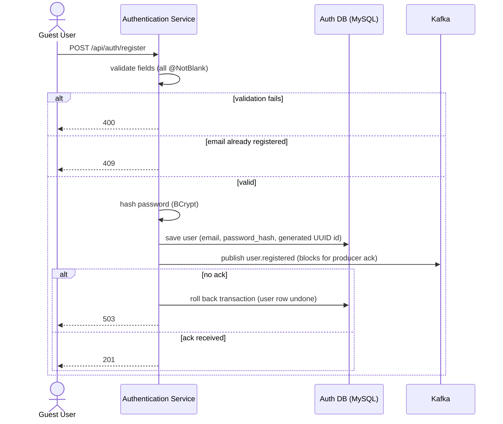
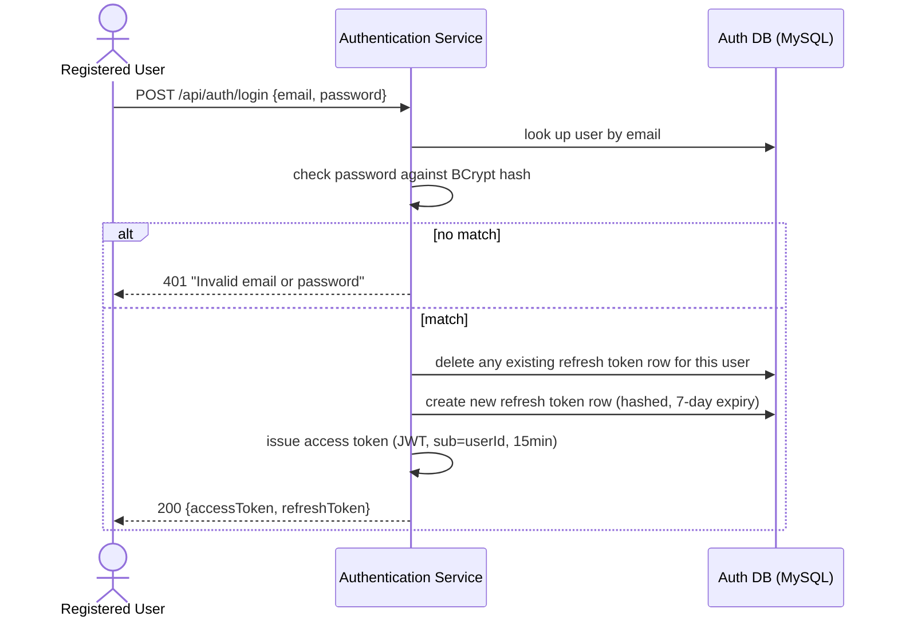
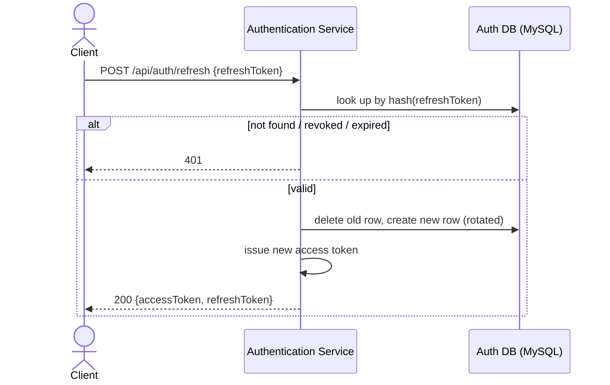
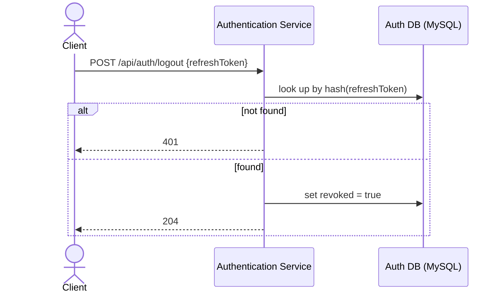
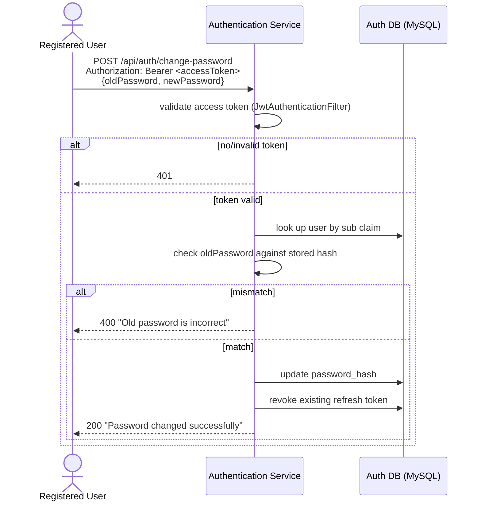

# Key Flows

## Registration

UserProfile Service consumes `user.registered` independently and asynchronously afterward — see
[`messaging.md`](./messaging.md) and [UserProfile's flows](../user-profile-service/flows.md).

## Login

## Refresh

## Logout

The access token already issued keeps working until its own 15-minute expiry — logout only
prevents it from being refreshed again.

## Change password

