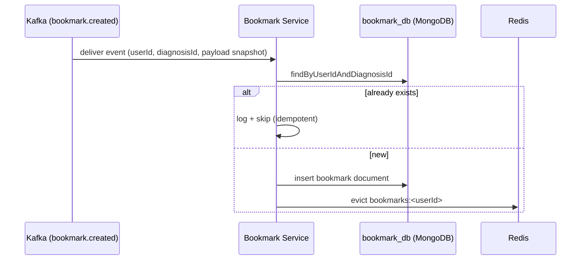
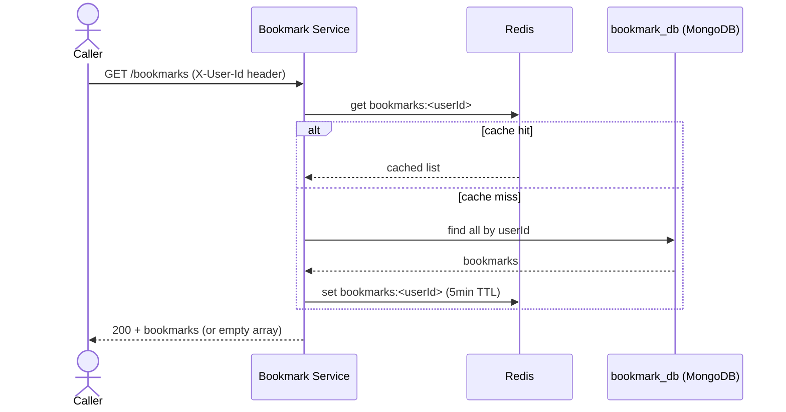
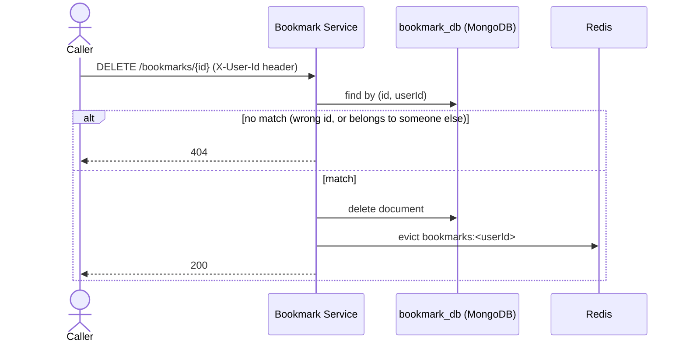

# Key Flows

## Bookmark creation (via Kafka, not an API call)

This is the only way a bookmark ever comes to exist — see [`messaging.md`](./messaging.md) and
[Diagnosis Service's flows](../diagnosis-service/flows.md) for what triggers the event.

## View bookmarks — `GET /bookmarks`

Never calls Diagnosis Service — the snapshot data is enough on its own.

## Remove a bookmark — `DELETE /bookmarks/{id}`

A cross-user delete attempt (right id, wrong `userId` header) returns the same `404` as a
non-existent id — a caller can't use the response to probe whether an id belongs to someone else.
