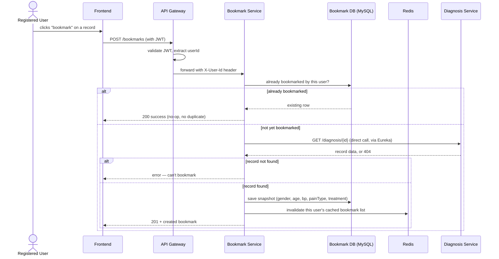
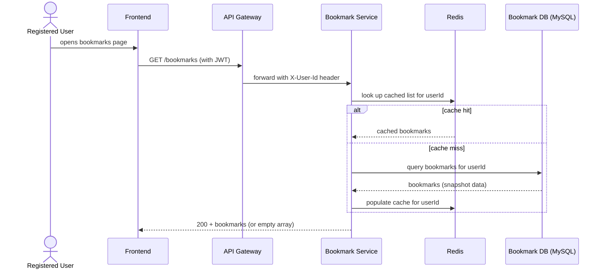
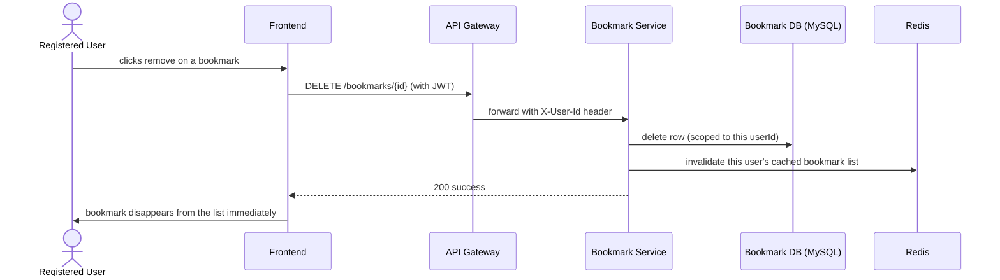

# Key Flows

## Bookmark a record — `POST /bookmarks`

1. Registered User clicks "bookmark" on a diagnosis record.
2. Request reaches Bookmark Service via the Gateway (protected route) with `X-User-Id` set.
3. Bookmark Service checks whether this user already bookmarked this record.
   - **Already bookmarked**: returns success without touching anything else — idempotent.
   - **Not yet bookmarked**: calls Diagnosis Service directly to confirm the record exists and
     get its display fields.
     - Not found → error, nothing saved.
     - Found → saves the snapshot, invalidates the cached list, returns the new bookmark.

## View bookmarks — `GET /bookmarks`

1. Registered User opens their bookmarks page.
2. Request reaches Bookmark Service via the Gateway with `X-User-Id` set.
3. Bookmark Service checks Redis first.
   - **Hit**: returns the cached list.
   - **Miss**: reads from MySQL, populates the cache, returns the list.
4. Never calls Diagnosis Service — the snapshot data is enough on its own (US-08).
5. Empty list → frontend shows the empty state (US-08), not a special API response.

## Remove a bookmark — `DELETE /bookmarks/{id}`

1. Registered User removes a bookmark.
2. Request reaches Bookmark Service via the Gateway with `X-User-Id` set.
3. Bookmark Service deletes the row — scoped to the caller's own `userId`, so nobody can delete
   another user's bookmark by guessing an ID.
4. Invalidates the cached list so the next `GET /bookmarks` reflects the removal.
5. Frontend removes it from the displayed list immediately (US-08).
