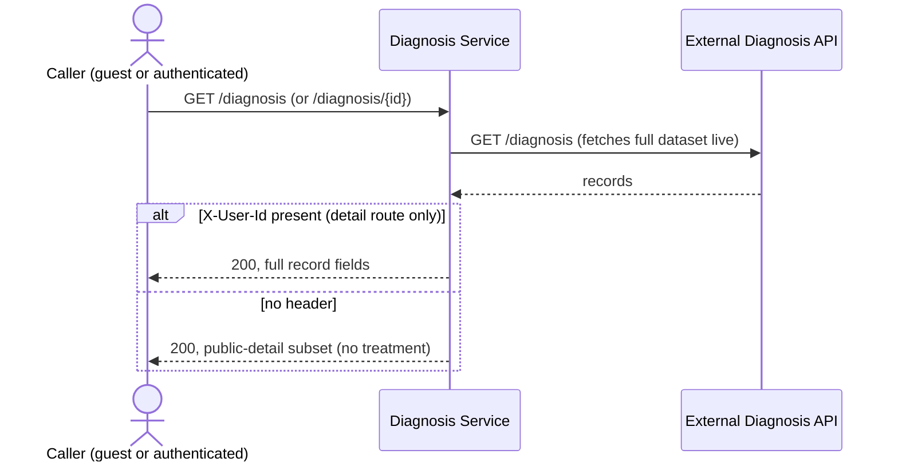
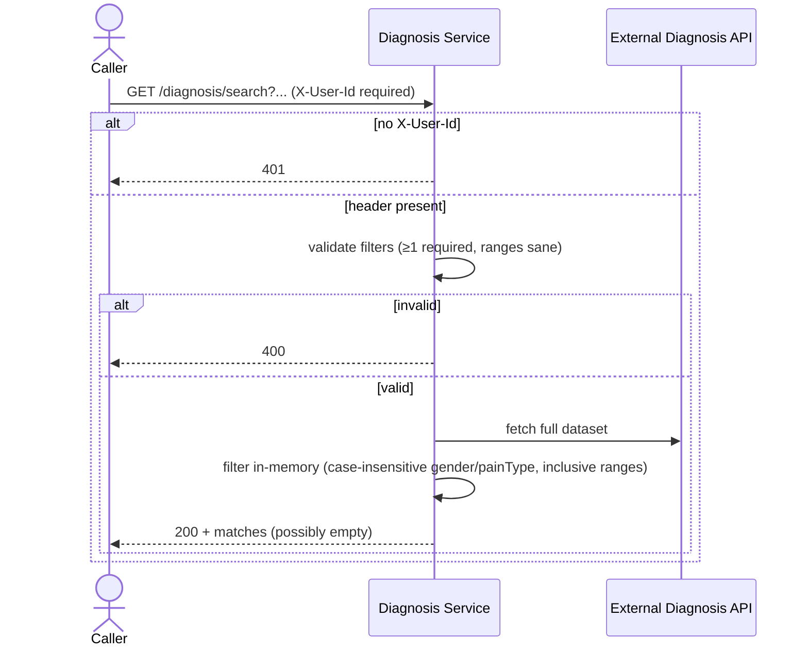
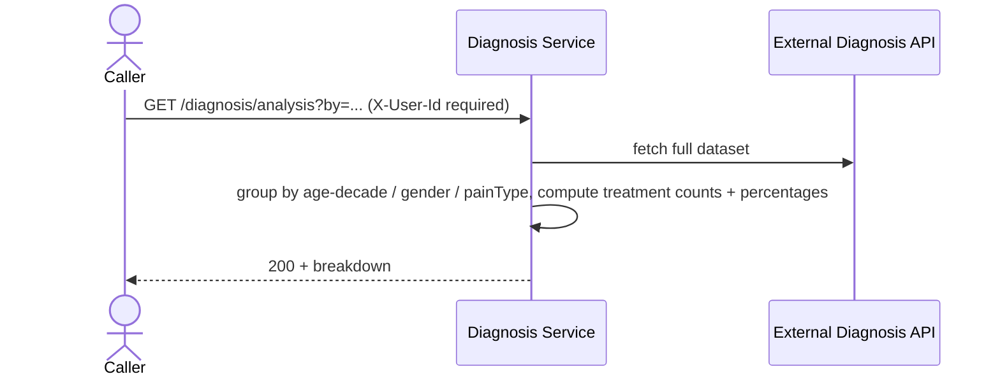
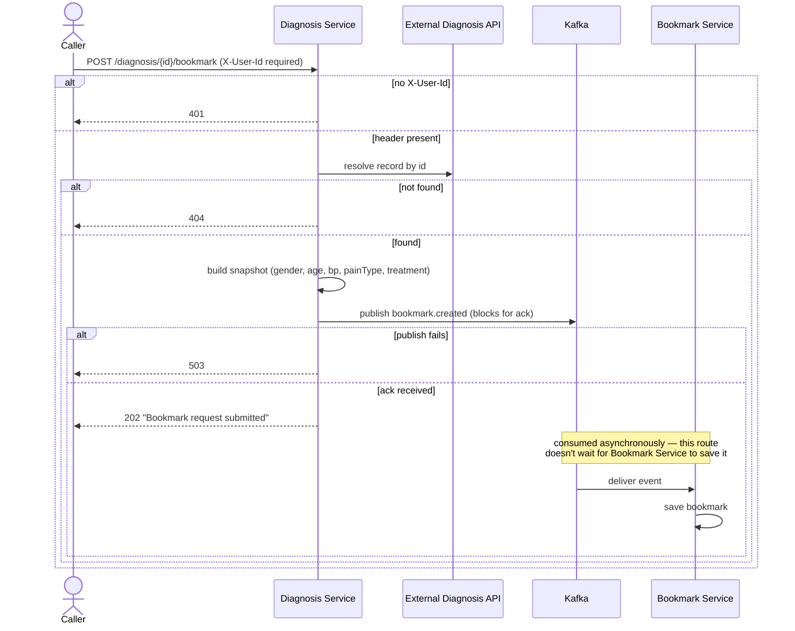

# Key Flows

## Browse / view a record

`GET /diagnosis` (list) never requires a header. `GET /diagnosis/{id}` changes response shape
depending on whether one is present.

## Advanced search

## Treatment analysis

Always the full dataset — current search filters never apply here.

## Bookmark creation

Diagnosis Service never learns whether Bookmark Service's save actually succeeded — `202` only
confirms the event reached Kafka. See [Bookmark Service's flows](../bookmark-service/flows.md)
for what happens after.
