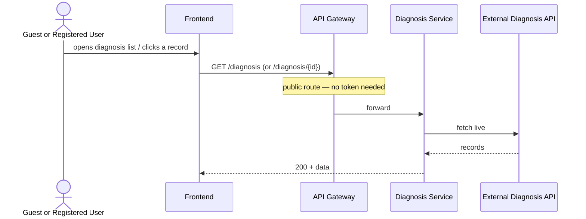
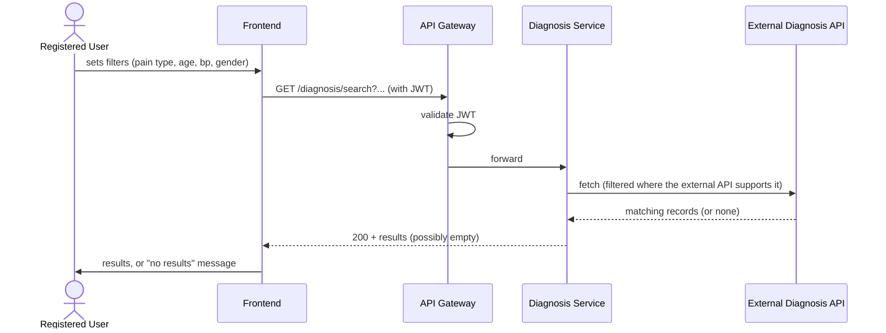
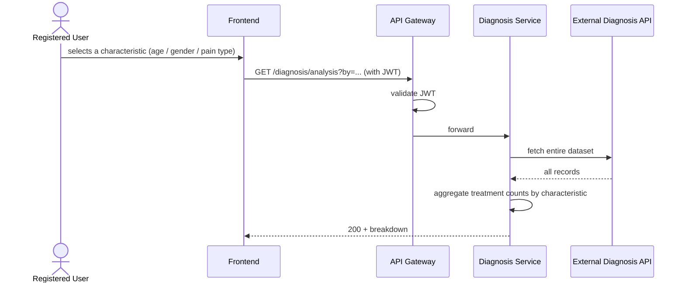
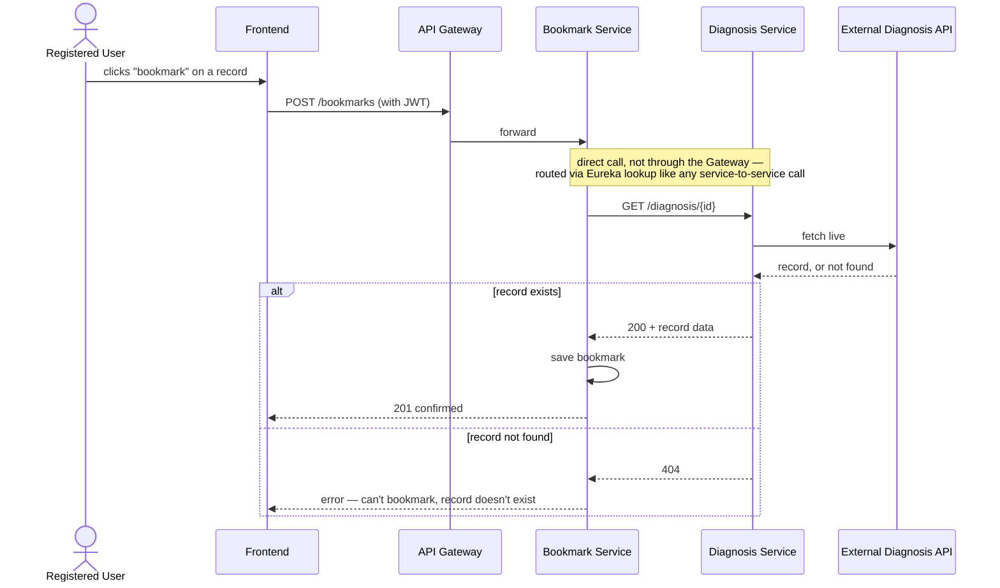

# Key Flows

## Browse / view a record — `GET /diagnosis`, `GET /diagnosis/{id}`

Both routes are public — Guest and Registered Users alike (US-04). Basic filtering across the
list the frontend already has is done client-side; not a backend concern.

## Advanced search — `GET /diagnosis/search` (Protected)

Registered-only (US-05, deliberately restricted from the original "Guest or Registered" spec —
see [ADR-0009](../../00-infrastructure/adr/0009-route-level-authorization-at-gateway.md) for how
the Gateway enforces this). An empty result set is a normal 200 response, not an error.

## Treatment analysis — `GET /diagnosis/analysis` (Protected)

Registered-only per US-06. Always runs against the **full** dataset, not just current search
results — a fresh fetch + aggregation on every call, no caching (see
[`api-contract.md`](./api-contract.md)).

## Bookmark validation — the direct call

This is the one real direct service-to-service call in this system (see
[`messaging.md`](./messaging.md) for why it isn't Kafka). Exact request/response shape for
Bookmark's own side — snapshot vs. thin reference, exactly what `POST /bookmarks` looks like —
is deferred to Bookmark Service's own docs.
