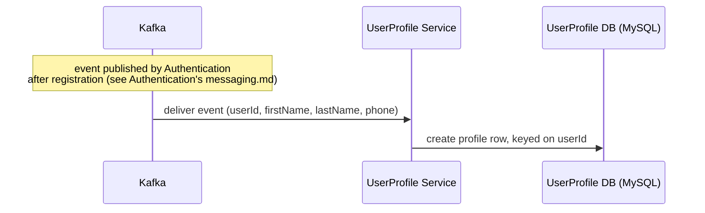
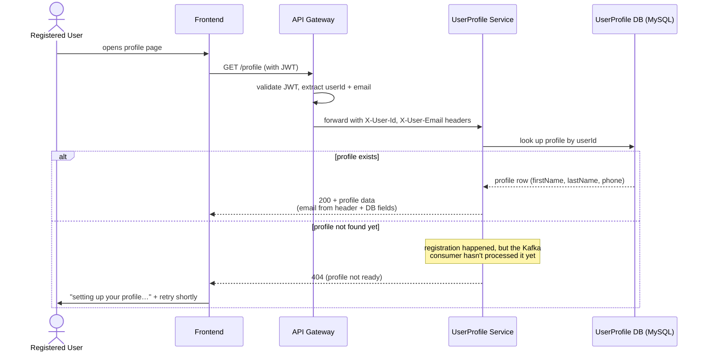
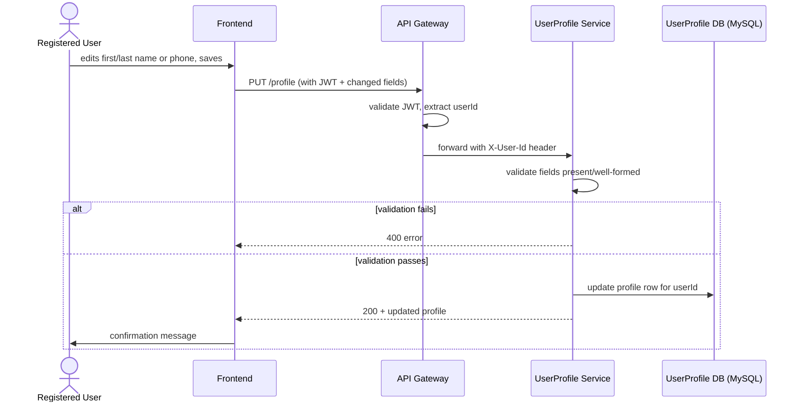

# Key Flows

## Profile creation (via Kafka, not an API call)

This is the only way a `profiles` row ever comes to exist — see
[`messaging.md`](./messaging.md). It happens independently of, and slightly after, the user
being told "registered successfully" by Authentication.

## View profile — `GET /profile`

1. Registered User opens their profile page.
2. Request reaches UserProfile Service via the Gateway (protected route) with `X-User-Id` and
   `X-User-Email` set.
3. UserProfile looks up the profile row by that ID.
4. **Normal case**: found → returns it, combining `email` straight from the header with
   `firstName`/`lastName`/`phone` from the database row (see [`data-model.md`](./data-model.md)
   and [ADR-0013](../../00-infrastructure/adr/0013-email-never-duplicated-into-userprofile.md)).
5. **Edge case — just registered**: a valid JWT only proves the user successfully logged in, not
   that their profile row exists yet (per the timing gap noted in
   [`messaging.md`](./messaging.md)). If nothing is found, UserProfile returns 404 rather than a
   generic server error, and the frontend treats this specific case as "still being set up" —
   showing a friendly loading state and retrying shortly — instead of an alarming error message.
   This should resolve within moments in practice; it's not expected to be a real 404 in any
   other case, since every user eventually gets a profile row.

## Update profile — `PUT /profile`

1. Registered User edits their name or phone number and saves.
2. Request reaches UserProfile Service via the Gateway (protected route) with `X-User-Id` set.
3. UserProfile validates the submitted fields (US-09 acceptance criteria).
   - Invalid → error returned, nothing saved.
4. Valid → updates the row for that `userId`.
5. Returns the updated profile; the frontend shows a confirmation message (US-09).
