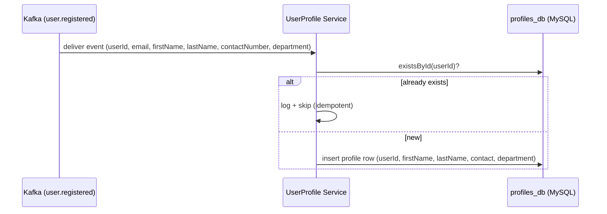
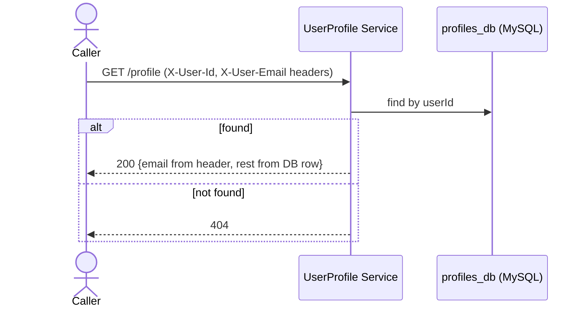
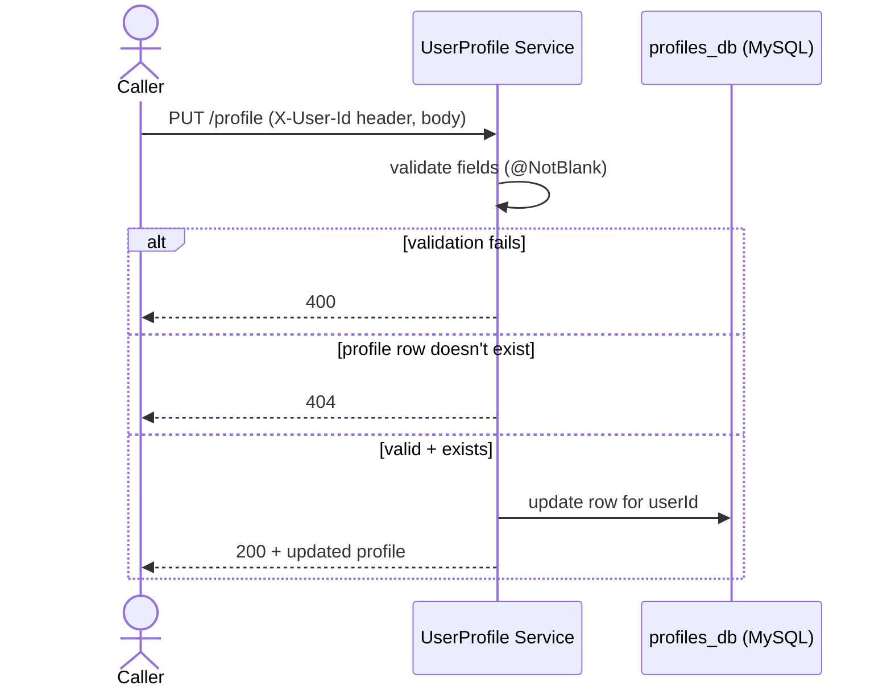

# Key Flows

## Profile creation (via Kafka, not an API call)

This is the only way a `profiles` row ever comes to exist. It happens independently of, and
slightly after, the client being told "registered successfully" by Authentication.

## View profile — `GET /profile`

The 404 case is expected to be transient: it only happens in the short window between a
successful login and this service having consumed the `user.registered` event for that user.

## Update profile — `PUT /profile`

