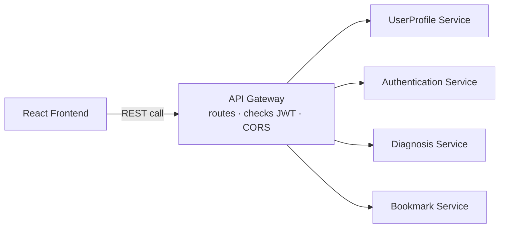
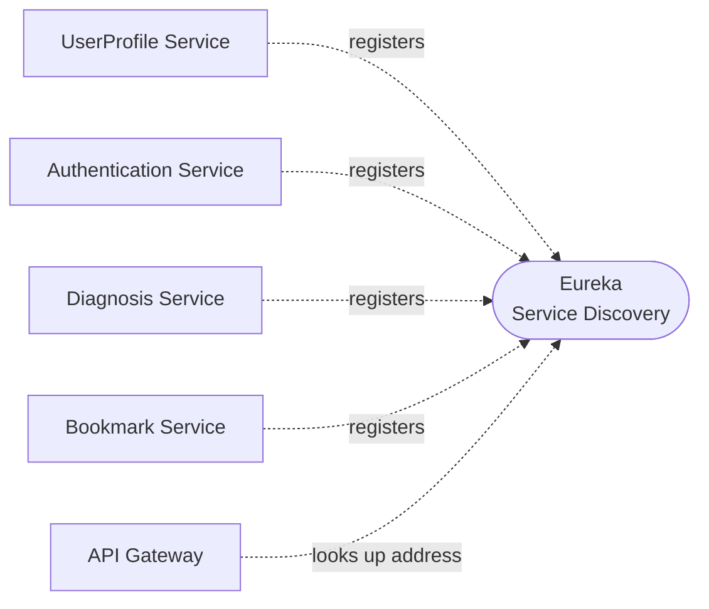
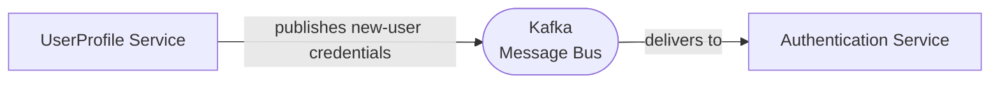
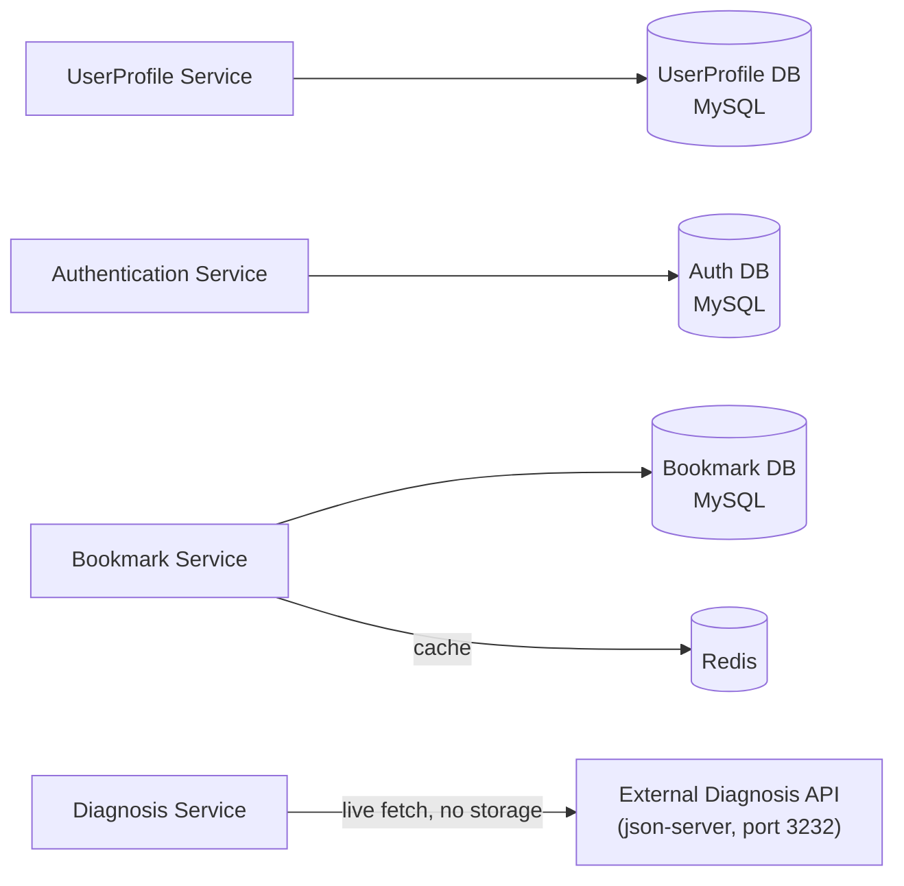

# System Architecture — Overview

One diagram trying to show every kind of connection at once (requests, discovery, events, data)
gets noisy fast. So this is broken into four small diagrams, each answering one question. Read
this before opening any individual service doc — those go one level deeper into a single box
shown here.

## 1. Request flow — what happens when the client calls the backend

The path a normal API call takes. This is the one to look at first.

The client only ever talks to the Gateway — it never knows a service's real address.

## 2. Service discovery — how the Gateway finds a service

Services don't have fixed addresses; they register themselves and the Gateway looks them up.

Every service registers with Eureka on startup; the Gateway asks Eureka "where is X right now?"
instead of using a hardcoded URL.

## 3. Async messaging — the one event flow in the system

Today there's exactly one thing that happens via an event instead of a direct call: registration.

See [ADR-0001](./00-infrastructure/adr/0001-async-registration-via-kafka.md) for why this is async instead of a
direct call, and [ADR-0004](./00-infrastructure/adr/0004-registration-race-handled-by-generic-login-error.md) for
how the small timing gap is handled.

## 4. Data ownership — what each service persists, and where

Each service owns its own storage. No service reaches into another's database.

Diagnosis Service is the odd one out: it has no database of its own — see
[ADR-0003](./00-infrastructure/adr/0003-diagnosis-service-stateless-no-db.md).

## What each piece is for

| Component | Role |
|---|---|
| **React Frontend** | The only thing the end user sees. Built with Vite + React + TanStack Query/Router + MUI. Talks to the backend exclusively through the API Gateway — never calls a service directly. |
| **API Gateway** | Single front door for every request, built with Spring Cloud Gateway. Validates the JWT on incoming calls, decides which routes even require one, applies CORS rules, and routes each request to the right service by asking Eureka where that service currently lives. |
| **Eureka (Service Discovery)** | A directory of "who's alive and where." Every service registers itself on startup; the Gateway (and services that call each other) look up addresses here instead of hardcoding them. |
| **Kafka (Message Bus)** | Carries events between services that shouldn't call each other directly. Today's only flow: UserProfile publishes new-user credentials when someone registers, and Authentication consumes them to create the login record. |
| **Redis (Cache)** | Speeds up reads for data that's requested often and changes rarely — currently a user's bookmark list, so the Bookmark Service doesn't hit its database on every page load. |
| **UserProfile Service** | Owns a user's personal/profile data. Handles registration and profile updates. |
| **Authentication Service** | Owns credentials and sessions. Handles login/logout, password reset, and issues/validates JWTs. |
| **Diagnosis Service** | Fetches and serves diagnosis records from the external Diagnosis API — it doesn't own its own database, it's a pass-through/aggregation layer over that external source. |
| **Bookmark Service** | Owns which diagnosis records a user has saved. |
| **External Diagnosis API** | Not part of this system — a separate data source (json-server) the Diagnosis Service calls out to. |

## How services talk to each other

- **Client → backend**: always synchronous, always through the API Gateway. The frontend never
  knows a service's real address — only the Gateway's.
- **Service → service (direct)**: synchronous calls between services, when one needs an
  immediate answer from another, are routed the same way — via the Gateway/Eureka lookup, not
  hardcoded URLs.
- **Service → service (event)**: asynchronous, via Kafka, for anything that doesn't need an
  immediate response. Today that's just the registration hand-off from UserProfile to
  Authentication — full topic-by-topic detail lives in the Kafka doc once written.
- **Service → cache**: only the Bookmark Service talks to Redis today.
- **Service → external system**: only the Diagnosis Service talks outward, to the external
  Diagnosis API.

## Data ownership

Each service owns its own data — no service reaches into another service's database directly.
If a service needs data it doesn't own, it asks for it (via the Gateway/Eureka, or via Kafka),
never queries another service's DB.

| Service | Owns | Storage |
|---|---|---|
| UserProfile Service | User profile/personal details | MySQL |
| Authentication Service | Credentials, sessions, JWT state | MySQL |
| Bookmark Service | Bookmarked records, cached in Redis | MySQL + Redis |
| Diagnosis Service | Nothing persisted — reads live from the external Diagnosis API | — |

## Key decisions

These were settled during architecture review — see the linked ADR for the reasoning behind
each:

- [ADR-0001](./00-infrastructure/adr/0001-async-registration-via-kafka.md) — registration hands off from
  UserProfile to Authentication via Kafka, not a direct call.
- [ADR-0002](./00-infrastructure/adr/0002-centralized-jwt-validation-at-gateway.md) — JWT validation happens once,
  at the Gateway, not in every service.
- [ADR-0003](./00-infrastructure/adr/0003-diagnosis-service-stateless-no-db.md) — Diagnosis Service stays
  stateless, no local database; it calls the external API live.
- [ADR-0004](./00-infrastructure/adr/0004-registration-race-handled-by-generic-login-error.md) — a login attempted
  before registration finishes processing just gets a generic "invalid credentials" error.
- [ADR-0005](./00-infrastructure/adr/0005-stateless-jwt-validation-at-gateway.md) — the Gateway validates JWTs
  itself with a shared key, no network call to Authentication per request.
- [ADR-0006](./00-infrastructure/adr/0006-frontend-stack-vite-react-tanstack-mui.md) — frontend
  stack: Vite + React + TanStack Query/Router + MUI, no Next.js/SSR.
- [ADR-0007](./00-infrastructure/adr/0007-backend-build-and-gateway-tooling.md) — backend build
  tool (Maven) and API Gateway implementation (Spring Cloud Gateway).
- [ADR-0008](./00-infrastructure/adr/0008-mysql-as-database-engine.md) — MySQL as the database
  engine for every service that owns data.
- [ADR-0009](./00-infrastructure/adr/0009-route-level-authorization-at-gateway.md) — the Gateway
  also enforces which routes require auth at all, not just token validity.

Bookmark Service's Redis cache is invalidated (not updated) on every add/remove, so the next read
repopulates it — full detail lands in the Redis doc once written.

## Where to go deeper

- [`00-infrastructure/`](./00-infrastructure/README.md) — build/run notes for Eureka, API
  Gateway, Kafka, and Redis individually.
- `01-services/` — one folder per backend service, each with its own responsibilities, data,
  and key flows.
- `02-frontend/` — the React app.
- `04-deployment/` — the Docker Compose setup that brings all of this up with one command.

## Status

✅ The system-wide shape above (service boundaries, sync vs. async communication, auth flow,
data ownership) has been through architecture review — see **Key decisions**. Deeper,
service-specific decisions (exact DB technology per service, Kafka topic/payload schemas, API
contracts) are still open and will be grilled when each service's own doc is drafted.
