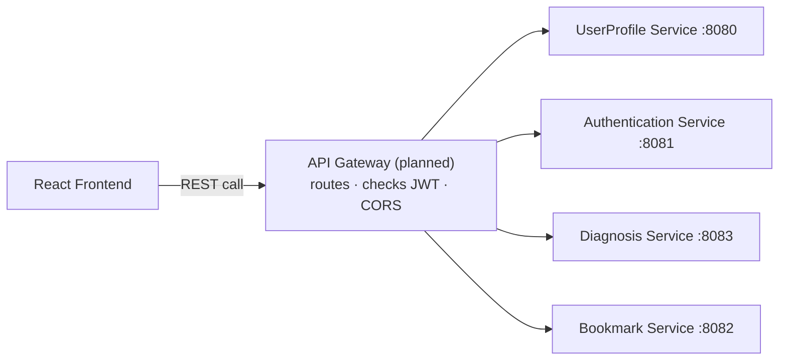
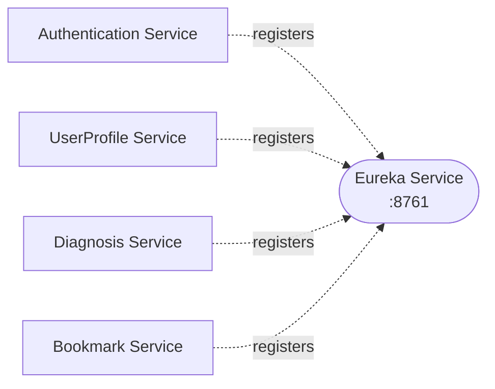
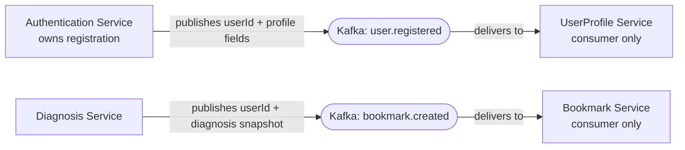
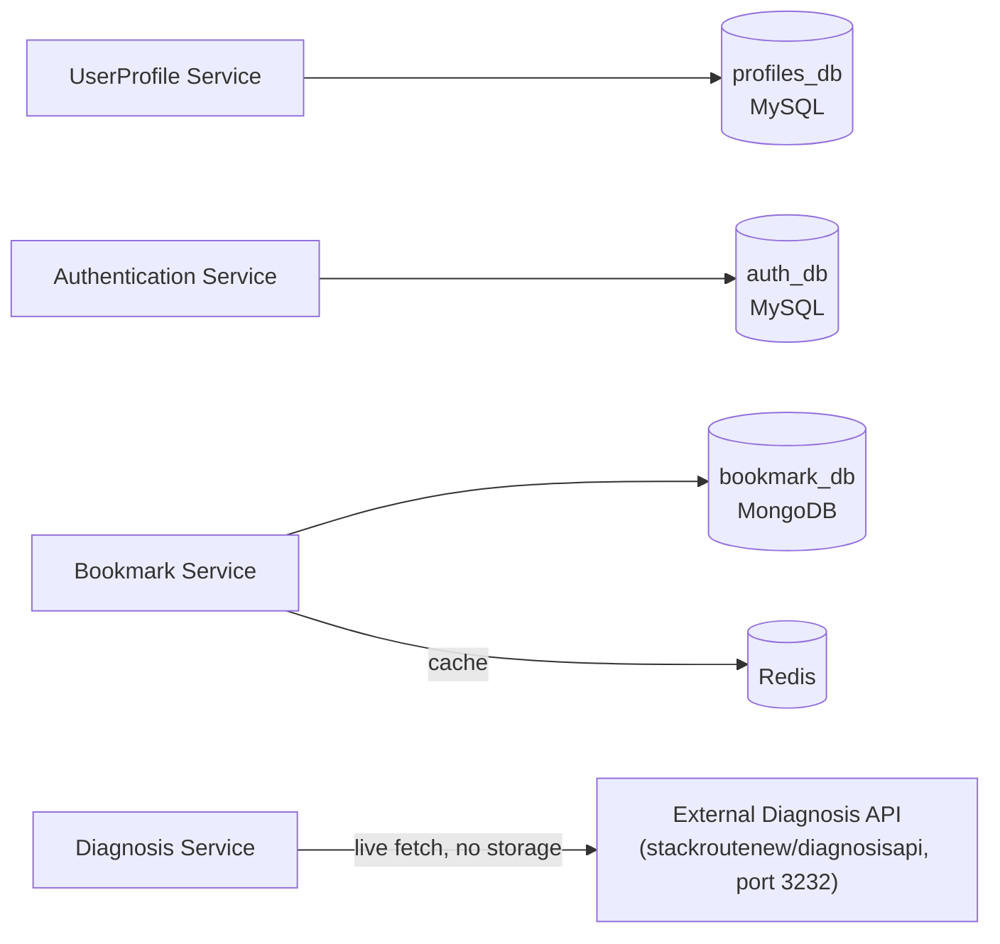

# System Architecture — Overview

One diagram trying to show every kind of connection at once (requests, discovery, events, data)
gets noisy fast. So this is broken into four small diagrams, each answering one question. Read
this before opening any individual service doc — those go one level deeper into a single box
shown here.

## 1. Request flow — what happens when the client calls the backend

The path a normal API call takes, **once the Gateway exists**. The Gateway itself is not built
yet ([`00-infrastructure/api-gateway/`](./00-infrastructure/api-gateway/README.md) is still a
plan) — today, each service is called directly on its own port, and every service trusts
`X-User-Id`/`X-User-Email` headers as plain, unverified headers rather than a Gateway-forwarded,
JWT-verified identity. See the trust-model note in each service's own README.

## 2. Service discovery — built and running

Services don't have fixed addresses; they register themselves with Eureka on startup. There's no
Gateway yet to consume the registry, but every service already registers.

See [`00-infrastructure/eureka-service/`](./00-infrastructure/eureka-service/README.md).

## 3. Async messaging — two event flows, both one-way

Both flows are strictly one-way, publisher-only on one side, consumer-only on the other — no
service both publishes and consumes. See
[ADR-0010](./00-infrastructure/adr/0010-registration-owned-by-auth-single-direction-kafka.md) for
the registration flow's reasoning, and [Diagnosis Service's `messaging.md`](./01-services/diagnosis-service/messaging.md)
for why the bookmark flow is Kafka-based rather than a direct synchronous call (an earlier design
this replaced).

## 4. Data ownership — what each service persists, and where

Each service owns its own storage. No service reaches into another's database.

Diagnosis Service is the odd one out: it has no database of its own — see
[ADR-0003](./00-infrastructure/adr/0003-diagnosis-service-stateless-no-db.md). Bookmark Service
is the other odd one out: it's MongoDB, not MySQL, plus Redis in front of it.

## What each piece is for

| Component | Role |
|---|---|
| **React Frontend** | Not built yet. Will talk to the backend exclusively through the API Gateway once it exists. |
| **API Gateway** | **Not built yet** — see [`00-infrastructure/api-gateway/`](./00-infrastructure/api-gateway/README.md), still a plan (Spring Cloud Gateway, JWT validation, route protection, forwards identity as headers). Until it exists, clients call each service directly on its own port. |
| **Eureka Service** | **Built and running.** A directory of "who's alive and where." Every backend service registers itself on startup with a 30s heartbeat / 90s eviction. Nothing consumes the registry programmatically yet (that's the Gateway's job, once built) — see [`00-infrastructure/eureka-service/`](./00-infrastructure/eureka-service/README.md). |
| **Kafka (Message Bus)** | Carries events between services that shouldn't call each other directly. Two flows today: (1) Authentication publishes `user.registered`, UserProfile consumes it. (2) Diagnosis Service publishes `bookmark.created`, Bookmark Service consumes it. Both one-way. |
| **Redis (Cache)** | Speeds up reads for data that's requested often and changes rarely — currently a user's bookmark list, so Bookmark Service doesn't hit MongoDB on every page load. |
| **UserProfile Service** | Owns a user's personal/profile data. Profile records are created asynchronously (via Kafka) after Authentication completes registration; handles profile updates directly thereafter. |
| **Authentication Service** | Owns credentials and registration. Handles registration, login, refresh-token rotation, logout, and password change; issues JWT access tokens. |
| **Diagnosis Service** | Fetches and serves diagnosis records from the real external Diagnosis API — no database of its own, a pass-through/aggregation layer. Also owns bookmark **creation** — it publishes the snapshot event Bookmark Service consumes. |
| **Bookmark Service** | Owns which diagnosis records a user has saved. Creates bookmarks only by consuming Diagnosis Service's Kafka event; serves list/remove directly. |
| **External Diagnosis API** | Not part of this system — the real `stackroutenew/diagnosisapi` Docker container, port `3232`, that Diagnosis Service calls out to. |

## How services talk to each other

- **Client → backend**: today, direct calls to each service's own port (no Gateway yet). Once
  the Gateway is built, this becomes always-through-the-Gateway, as planned.
- **Service → service**: there is **no direct synchronous call between any two backend services**
  in this system. The only cross-service connections are the two one-way Kafka flows above.
- **Service → cache**: only Bookmark Service talks to Redis.
- **Service → external system**: only Diagnosis Service talks outward, to the external Diagnosis
  API.

## Data ownership

Each service owns its own data — no service reaches into another service's database directly.

| Service | Owns | Storage |
|---|---|---|
| UserProfile Service | User profile/personal details | MySQL (`profiles_db`) |
| Authentication Service | Credentials, refresh tokens | MySQL (`auth_db`) |
| Bookmark Service | Bookmarked records (snapshots), cached in Redis | MongoDB (`bookmark_db`) + Redis |
| Diagnosis Service | Nothing persisted — reads live from the external Diagnosis API | — |

## Key decisions

These were settled during architecture review — see the linked ADR for the reasoning behind
each:

- ~~[ADR-0001](./00-infrastructure/adr/0001-async-registration-via-kafka.md) — registration hands off from
  UserProfile to Authentication via Kafka, not a direct call.~~ Superseded by ADR-0010.
- [ADR-0002](./00-infrastructure/adr/0002-centralized-jwt-validation-at-gateway.md) — JWT validation happens once,
  at the Gateway, not in every service.
- [ADR-0003](./00-infrastructure/adr/0003-diagnosis-service-stateless-no-db.md) — Diagnosis Service stays
  stateless, no local database; it calls the external API live.
- ~~[ADR-0004](./00-infrastructure/adr/0004-registration-race-handled-by-generic-login-error.md) — a login attempted
  before registration finishes processing just gets a generic "invalid credentials" error.~~ Superseded by ADR-0010.
- [ADR-0005](./00-infrastructure/adr/0005-stateless-jwt-validation-at-gateway.md) — the Gateway validates JWTs
  itself with a shared key, no network call to Authentication per request.
- [ADR-0006](./00-infrastructure/adr/0006-frontend-stack-vite-react-tanstack-mui.md) — frontend
  stack: Vite + React + TanStack Query/Router + MUI, no Next.js/SSR.
- [ADR-0007](./00-infrastructure/adr/0007-backend-build-and-gateway-tooling.md) — backend build
  tool (Maven) and API Gateway implementation (Spring Cloud Gateway).
- [ADR-0008](./00-infrastructure/adr/0008-mysql-as-database-engine.md) — MySQL as the default
  database engine (Authentication, UserProfile); Bookmark Service deviated to MongoDB + Redis in
  practice — see its own [`data-model.md`](./01-services/bookmark-service/data-model.md).
- [ADR-0009](./00-infrastructure/adr/0009-route-level-authorization-at-gateway.md) — the Gateway
  also enforces which routes require auth at all, not just token validity.
- [ADR-0010](./00-infrastructure/adr/0010-registration-owned-by-auth-single-direction-kafka.md) —
  registration moved to Authentication Service; UserProfile only consumes, no more two-way
  Kafka hand-off. Supersedes ADR-0001 and ADR-0004.
- [ADR-0011](./00-infrastructure/adr/0011-registration-waits-for-kafka-producer-ack.md) —
  registration waits for Kafka's producer acknowledgment (not full consumption) before
  responding, and rolls back the credential if that ack never comes — profile data lives only
  in that Kafka message, so losing the publish would lose it permanently.
- [ADR-0012](./00-infrastructure/adr/0012-gateway-forwards-identity-via-headers.md) — the
  Gateway forwards identity as `X-User-Id`/`X-User-Email` headers after validating a JWT,
  instead of every service parsing tokens itself.
- [ADR-0013](./00-infrastructure/adr/0013-email-never-duplicated-into-userprofile.md) — email is
  never stored outside Authentication; UserProfile reads it live from the Gateway header instead
  of keeping its own copy.
- [ADR-0014](./00-infrastructure/adr/0014-bookmark-stores-snapshot-not-reference.md) — Bookmark
  Service stores a snapshot of a diagnosis record, not just its ID, so viewing bookmarks never
  depends on Diagnosis Service being up. In the as-built system this is moot for a different
  reason too: there is no direct call between the two services at all — see the Async messaging
  section above.
- [ADR-0015](./00-infrastructure/adr/0015-spring-cloud-2025-1-3-for-boot-4-eureka.md) — every
  service pins Spring Cloud `2025.1.3`, the first release train confirmed compatible with Spring
  Boot 4.0.8, for the standard Eureka client/server starters.

Bookmark Service's Redis cache is invalidated on every write (Kafka-consumed create, and
`DELETE /bookmarks/{id}`) **and** carries a 5-minute TTL as a backstop — see Bookmark Service's
[`config-env.md`](./01-services/bookmark-service/config-env.md).

## Where to go deeper

- [`00-infrastructure/`](./00-infrastructure/README.md) — build/run notes for Eureka (built), the
  API Gateway (planned), Kafka, and Redis.
- `01-services/` — one folder per backend service, each with its own responsibilities, data,
  and key flows — this is the as-built source of truth today.
- `02-frontend/` — not started.
- `04-deployment/` — the root `docker-compose.yml` brings every built service up with one command
  (`mysql`, `kafka`, `mongo`, `redis`, `eureka`, `diagnosis-api`, and all 4 backend services).

## Status

✅ Four backend services (Authentication, UserProfile, Diagnosis, Bookmark) and Eureka Service are
built, containerized, and verified working together end-to-end via Docker Compose. 🚧 API
Gateway and frontend are not built yet — the diagrams above mark what's planned vs. what's
running. Docs in `01-services/` reflect the actual running code, not the original pre-build
design (see each service's own doc for any place it deviates from an earlier plan).
