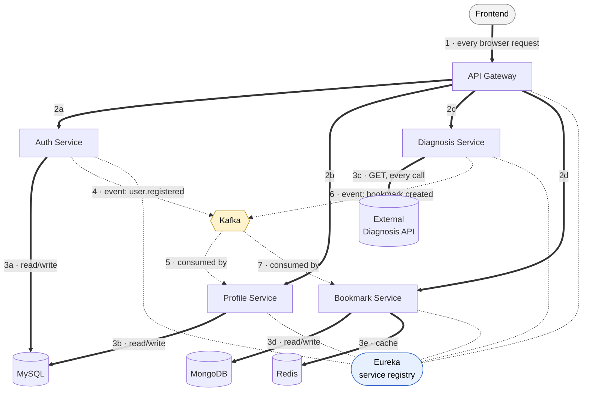
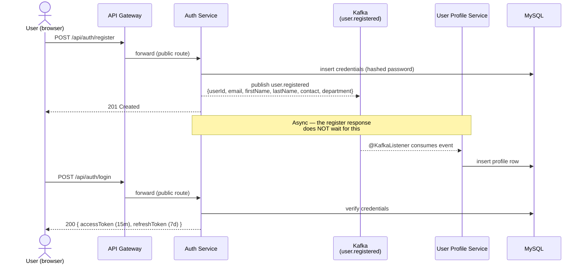
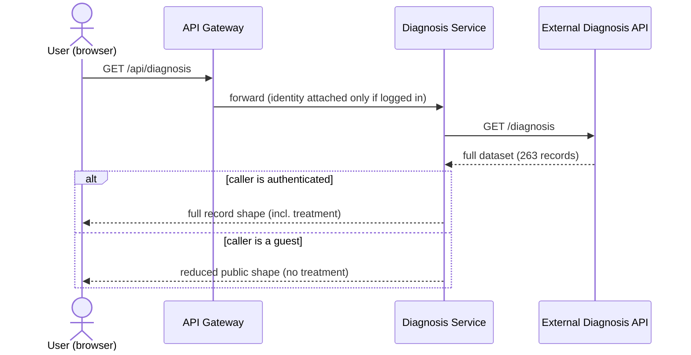
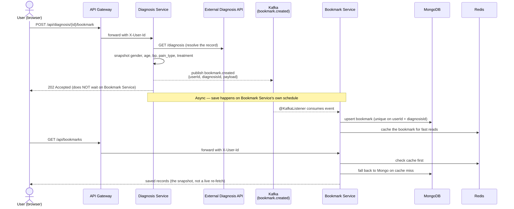

# System Flow — Visual Reference

This is the up-to-date picture of the **actual running system** (matches the code in
`docker-compose.yml` and each service, not the earlier planning docs in this folder). Start here
if you want to see how a request moves through the whole application, end to end.

For per-service internals, see [`ARCHITECTURE.md`](./ARCHITECTURE.md) and
[`01-services/`](./01-services/).

---

## 1. Everything that runs, and how it's wired

Ports for every box below are in the [Docker Compose table](#7-docker-compose--ports-and-dependency-order)
— left out here so the shapes stay readable.



**Reading it**
- **Thick arrows, numbered `1`→`3`** — the synchronous request path: browser → Gateway → one of
  the four services → that service's own datastore. This is the flow for a normal page load.
- **Dashed arrows, numbered `4`→`7`** — the two Kafka events, traced in full in
  [§3](#3-registration--profile-creation-the-one-place-kafka-drives-a-write) and
  [§6](#6-bookmarking--the-other-kafka-event-end-to-end) below.
- **Faint lines to Eureka** — every service registers itself there; the Gateway asks it "where is
  this service right now?" instead of using a fixed address. Not part of the request/response
  path, just how the Gateway finds everyone.
- The browser only ever talks to the **Gateway** (`:9090`) and the **frontend** (`:5173`). It
  never calls a backend service directly.

---

## 2. Gateway routing table

Every request the frontend makes goes through the Gateway first. It decides, per route, whether
a JWT is required and what identity it forwards downstream.

| Path prefix | Routed to | Auth | What the Gateway forwards |
|---|---|---|---|
| `/api/auth/**` | Auth Service | Public | Nothing added — passthrough |
| `/api/profile/**` | User Profile Service | **Required** — 401 if missing/invalid | `X-User-Id`, `X-User-Email`, `X-Identity-Signature` |
| `/api/diagnosis/**` | Diagnosis Service | Optional — attaches identity if a valid token is present, otherwise passes through anonymous | `X-User-Id`, `X-Identity-Signature` (if authenticated) |
| `/api/bookmarks/**` | Bookmark Service | **Required** — 401 if missing/invalid | `X-User-Id`, `X-Identity-Signature` |

Downstream services never see or decode the JWT themselves — they trust the `X-Identity-Signature`
header because only the Gateway holds the key to produce it. Any identity header a client tries to
send directly is stripped before forwarding.

---

## 3. Registration → profile creation (the one place Kafka drives a write)



Auth Service never calls Profile Service directly, and Profile Service never calls Auth Service —
the only connection between "an account exists" and "a profile exists" is the Kafka event. If
Profile Service is down when someone registers, the account is still created; the profile just
gets built once Profile Service comes back and drains the topic.

---

## 4. An authenticated request — JWT verification and identity hand-off

```mermaid
sequenceDiagram
    actor U as User (browser)
    participant GW as API Gateway
    participant P as User Profile Service

    U->>GW: GET /api/profile<br/>Authorization: Bearer &lt;accessToken&gt;
    GW->>GW: verify JWT signature + expiry
    alt token missing or invalid
        GW-->>U: 401 Unauthorized
    else token valid
        GW->>GW: strip any client-sent identity headers
        GW->>GW: sign X-User-Id / X-User-Email / X-Identity-Signature
        GW->>P: forward with signed identity headers
        P->>P: trust headers (signature proves they came from the Gateway)
        P-->>GW: profile data
        GW-->>U: 200 { firstName, lastName, contact, department, ... }
    end
```

The frontend also holds a **refresh token** (7 days). Before the 15-minute access token expires,
`AuthSessionManager` on the frontend proactively calls `POST /api/auth/refresh` to rotate both
tokens — the user never sees a forced logout mid-session unless the refresh token itself has
expired or been revoked.

---

## 5. Browsing diagnosis data — sourced live from an external API

Diagnosis Service holds **no diagnosis data of its own**. Every list, search, and detail call
fetches live from the external provider and reshapes the response.



`GET /api/diagnosis/search` and `GET /api/diagnosis/analysis` work the same way but require a
valid identity (registered users only) — Diagnosis Service fetches the same live dataset and
filters/aggregates it in memory per request; nothing is cached or persisted.

---

## 6. Bookmarking — the other Kafka event, end to end



Two things worth noticing: Diagnosis Service and Bookmark Service **never call each other
directly** — Kafka is the only connection — and what's returned from `GET /api/bookmarks` is the
snapshot taken at bookmark time, not a fresh lookup. If the source record changes later, the
saved bookmark doesn't.

---

## 7. Docker Compose — ports and dependency order

| Service | Container | Host port | Depends on (healthy/started) |
|---|---|---|---|
| MySQL | `cardiac-sql-service` | 3306 | — |
| Kafka | `cardiac-kafka-service` | 9092 (external), 19092 (internal) | — |
| MongoDB | `cardiac-nosql-service` | 27017 | — |
| Redis | `cardiac-redis-service` | 6379 | — |
| Eureka | `cardiac-eureka-service` | 8761 | — |
| Diagnosis API (external, 3rd-party image) | `cardiac-diagnosis-api` | 3232 | — |
| Auth Service | `cardiac-auth-service` | 8081 | MySQL, Kafka, Eureka |
| User Profile Service | `cardiac-user-profile-service` | 8080 | MySQL, Kafka, Eureka |
| Diagnosis Service | `cardiac-diagnosis-service` | 8083 | Diagnosis API, Kafka, Eureka |
| Bookmark Service | `cardiac-bookmark-service` | 8082 | MongoDB, Redis, Kafka, Eureka |
| API Gateway | `cardiac-api-gateway` | 9090 | Eureka, Auth, Profile, Diagnosis, Bookmark |
| Frontend | `cardiac-frontend-service` | **5173** → container `80` | API Gateway |

Bring the whole stack up with:

```bash
docker compose up -d
```

Then open **http://localhost:5173**.

---

## 8. The frontend's own routes, mapped to what they call

| Route | Auth | Backend calls |
|---|---|---|
| `/` | Public | `GET /api/diagnosis/stats` |
| `/login`, `/register` | Public | `POST /api/auth/login`, `POST /api/auth/register` |
| `/registry` | Guest → public view, Registered → full view | `GET /api/diagnosis` (guest), `GET /api/diagnosis/search` (registered), `GET /api/diagnosis/{id}` |
| `/analysis` | Registered only (redirects guests to `/registry` with a sign-in prompt) | `GET /api/diagnosis/analysis?by=age\|gender\|painType` |
| `/bookmarks` | Registered only | `GET /api/bookmarks`, `DELETE /api/bookmarks/{id}` |
| `/profile` | Registered only | `GET /api/profile`, `PUT /api/profile`, `POST /api/auth/change-password` |

Any protected route (`/analysis`, `/bookmarks`, `/profile`) hit while logged out — or while a
session has silently expired — redirects to `/registry` and opens the sign-in prompt naming the
page that needed an account, rather than dead-ending on a login wall.
